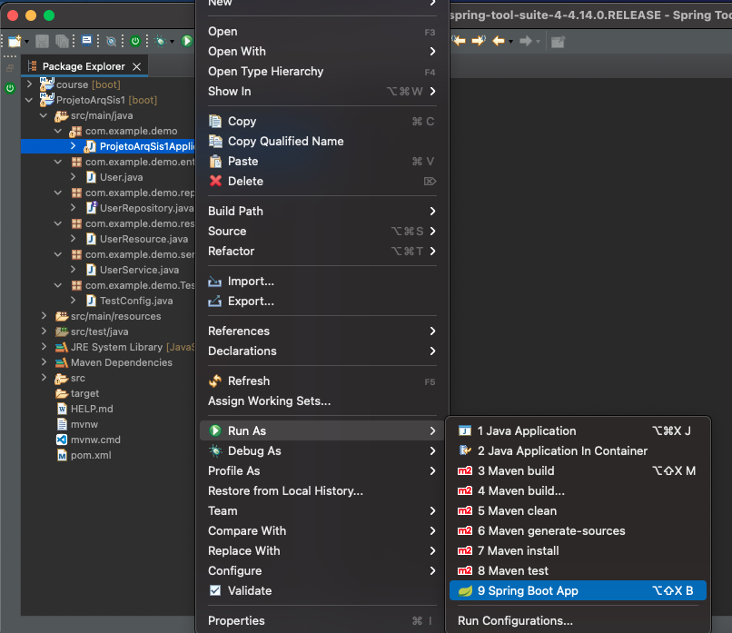
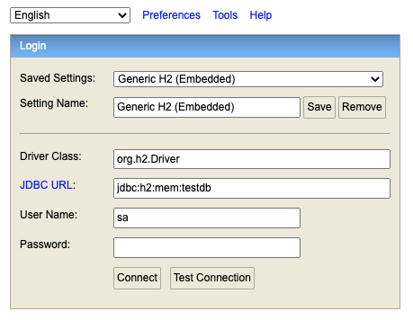
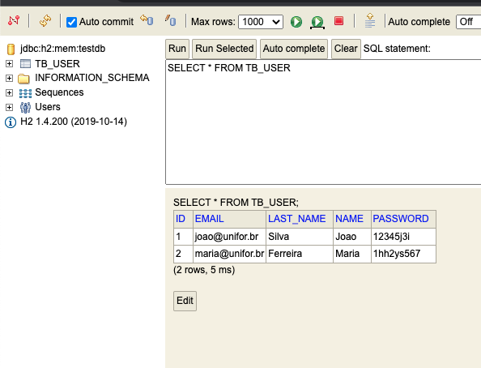

# Projeto 1 - Projeto de Arquitetura de Sistemas

## Sobre
 O Trabalho consisiste na criação de usuários no banco de dados em memória (h2), realizado em Sring Boot com JPA.

 ## Requisitos

 Para requisito do trabalho, foi solicitado um padrão Grasp e um padrão Gof no sistema.

 <strong>Foram utilizados os padrões: </strong>

<hr/>
Grasp: MVC - Model View Controller

Gof: Builder
<hr/>

## Padrões

O Padrão <strong>Grasp - MVC </strong>, está na estrutura do projéto que obtem requisições da View atavés de API e são recebidas no Backend através do controlador, o processamento os dados passam pela respectiva classe de serviços e assim acessam a interface de repositório que implementa os métodos de ligação com banco de dados.

O Padrão <strong> Gof - Builder </strong>, está na estrutura de entidade do usuário, a qual atribui a subclasse UserBuilder a responsabilidade de instancia-la, tornando melhor o entendimento do que está sendo inserido dentro do objeto ao criar uma instancia de usuário.

# Instalação

Para realizar a instação desse projeto são necessários


- Download e instalação do [Java JDK](https://www.oracle.com/java/technologies/downloads/).

- Download e instalação do STS - [Spring Tool Suit](https://www.oracle.com/java/technologies/downloads/).

- Download e instalação do [Insomnia](https://insomnia.rest/download) (Ou de preferencia).

- [Download](https://github.com/franciscocorreia383/ProjetoArqDeSistemasTrab1/archive/refs/heads/main.zip) do desse repositório.

<hr/>

Após a instalação, abrir o projeto no workspace do STS e esperar o projeto baixar as dependencias e carregar.

# Uso

Após carregar, clicar com botão direito sobre a classe ProjetoArqSis1Application.java e seguir os passos: <strong> Run As - Spring Boot Aplication </strong>.



Após carregar o servidor, acessar o [banco h2](http://localhost:8080/h2-console/) com as seguintes credenciais:





No Insomnia criar uma requisição do tipo POST para a URL http://localhost:8080/users para cadastro de usuários com o seguinte Body Json

```JSON
{
	"id" : null,
	"name" : "Name",
	"lastName" : "LastName",
	"email" : "email@email.com",
	"password" : "Password" 
}
```

Para verificar o usuário criado: Criar uma requisicão GET para a URL http://localhost:8080/users e executar para obter os usuários cadastrados.

Para verificar um usuário específico: Criar uma requisição GET para a URL http://localhost:8080/users/id e executar para obter o usuário cadastrado.


